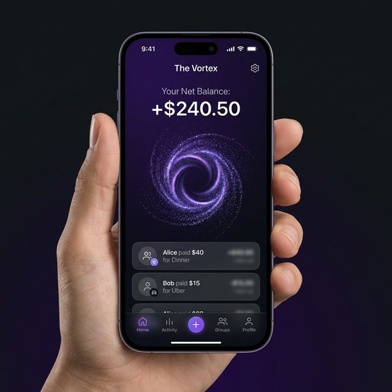
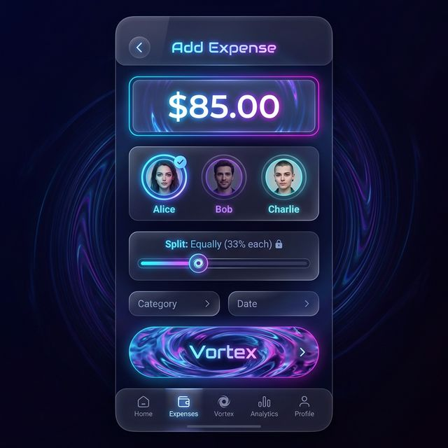
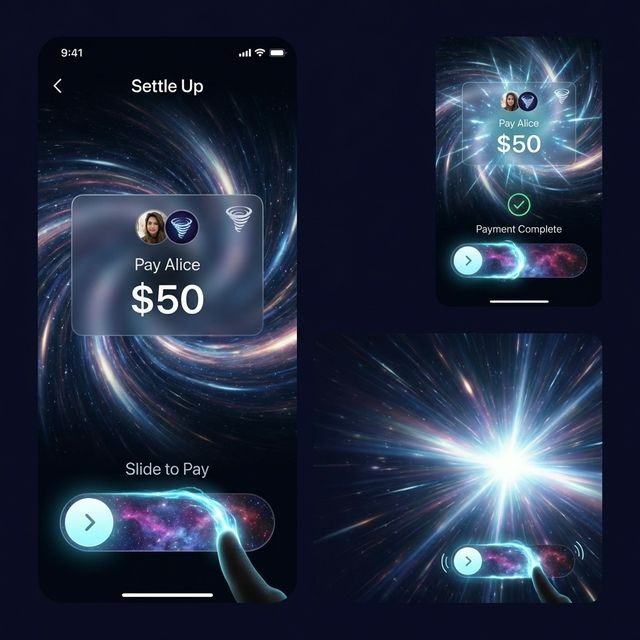

# Vortex MVP Design

## 1. Core Philosophy
"The Vortex" is a frictionless, high-end cost-sharing experience. It replaces the drudgery of spreadsheets with a premium, animated interface that makes settling debts feel satisfying.

## 2. User Stories

### Story 1: The Identity
**As a user**, I want to sign up with just a name and an avatar so I can be identified in the group.
-   **No passwords** (Magic links or social auth).
-   **Simple profile**: Just a display name and a chosen avatar.

### Story 2: The Vortex (Dashboard)
**As a user**, I want to see my net standing with the group instantly.
-   **Visual**: A swirling "Vortex" particle effect in the center.
-   **Data**: prominently displays "You are owed $X" (Green) or "You owe $Y" (Ready to Pay).
-   **Context**: A list of recent "facts on the ground" below (e.g., "Alice paid for Dinner").

### Story 3: Adding an Expense
**As a user**, I want to log a payment I made for the group.
-   **Input**: Large, glowing currency input.
-   **Selection**: Tap user avatars to include them in the split.
-   **Split Logic**: Default to "Split Equally", toggle for "Custom Amounts" or "Percentage".
-   **Action**: A satisfying "Throw into Vortex" animation when submitting.

### Story 4: Settling Up
**As a user**, I want to pay someone to reduce my debt.
-   **Trigger**: Tap "Settle Up" or a specific person's negative balance card.
-   **Interaction**: A "Slide to Pay" mechanism (like unlocking a phone) to confirm the transaction.
-   **Feedback**: Haptic vibration and a visual "warp speed" effect as the debt is cleared.

## 3. UX/UI Guidelines

### Aesthetic: "Nano Banana" / Neon Vortex
-   **Theme**: Dark Mode default. Deep purples, blacks, and electric blues/pinks.
-   **Materials**: Glassmorphism (blur + transparency) for cards and sheets.
-   **Typography**: Clean, wide sans-serif (e.g., 'Inter' or 'Outfit').
-   **Motion**:
    -   **View Transitions**: Elements morph between screens (e.g., the total amount morphs into the "pay" amount).
    -   **Particle Effects**: The generic background vortex accelerates when activity happens.

### Interaction
-   **Haptics**: Use `navigator.vibrate` for tactile feedback on sliders and successful submissions.
-   **Gestures**: Swipe to delete (drafts), pull to refresh (sync), slide to pay.
