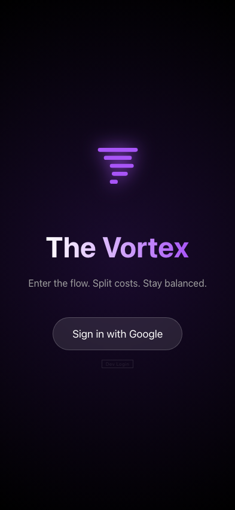
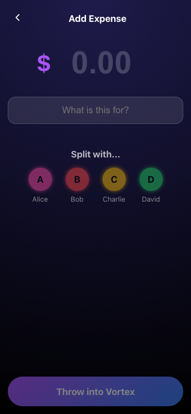
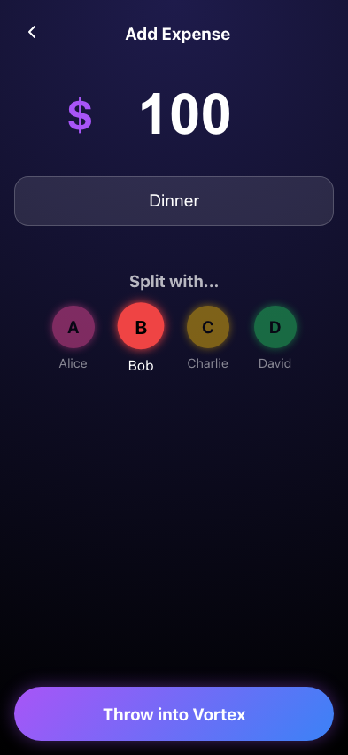
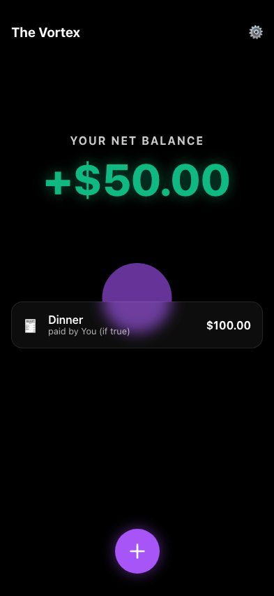

# Test: Complete Flow: Login -> Add Expense -> Dashboard -> Settle

## Load Login Page

**Verifications:**
- [x] Header is present

---

## Navigate to Dashboard after Login

**Verifications:**
- [x] Dashboard balance is visible
- [x] FAB is visible

---

## Open Add Expense Form

**Verifications:**
- [x] Amount input is visible

---

## Fill Expense Form

**Verifications:**
- [x] Bob is selected

---

## Dashboard shows new balance

**Verifications:**
- [x] Recent activity shows Dinner
- [x] Balance is +$50.00

---

## Settle Up Screen

**Verifications:**
- [x] Shows I am owed money

---

